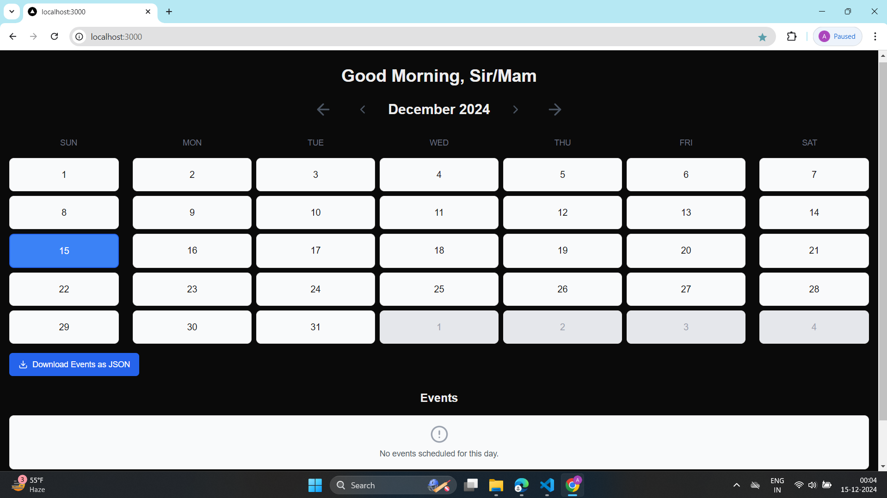
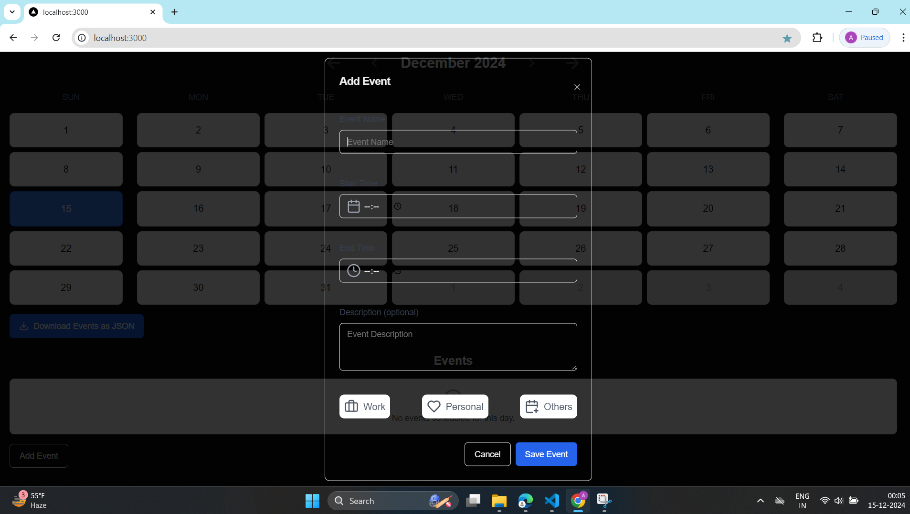
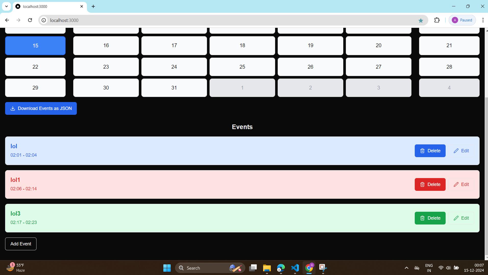
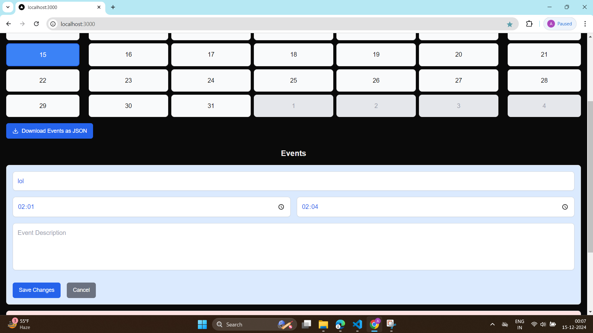

# Calendar Grid Application

A feature-rich and interactive calendar grid application built with React and `date-fns`. This app allows users to view a monthly calendar, navigate between months and years, and download events as a JSON file.

---

## Features

- **Interactive Calendar Grid:**
  - Displays the days of the current month and surrounding weeks.
  - Highlights the current day visually.
  - Allows selecting any day on the calendar.
  
- **Navigation:**
  - Navigate between months and years seamlessly using intuitive buttons.

- **Event Management:**
  - Fetches events for the current month from a context-based API (`getEventsOfMonth`).
  - Downloads the events of the selected month in JSON format.

- **Responsive UI:**
  - Works seamlessly across devices with a clean, minimalistic design.
  - Built with ShadCN UI components for consistent styling.

---
## Screenshots

### Home View


### Second


### third


### Fourth

## Getting Started

Follow these instructions to run the app locally.

### Prerequisites

- [Node.js](https://nodejs.org) (version 16 or later recommended)
- [npm](https://www.npmjs.com/) or [yarn](https://yarnpkg.com/)


### Installation

1. Clone the repository:
   ```bash
   git clone https://github.com/your-username/calendar-grid-app.git
   cd calendar-grid-app
   npm install
   npm run dev
